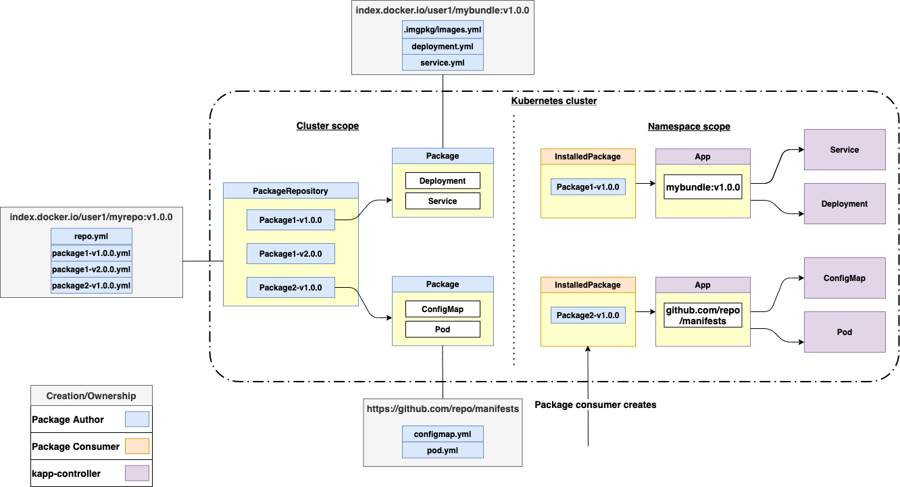

kapp-controller introduces resources that extend the Kubernetes API called custom resource definitions (CRDs). 
These CRDs are made available on a Kubernetes cluster when kapp-controller is installed to your cluster.

kapp-controller's CRDs are as follows:
* App
* Package
* PackageRepository
* InstalledPackage

The diagram below provides a high level overview of how Package CRs eventually become App CRs that are managed 
by kapp-controller and exist on your Kubernetes cluster. (Having trouble viewing the image? You can expand the 
window pane to make the image bigger.)

Packages and PackageRepositories are cluster scoped resources and InstalledPackages and Apps are namespace scoped 
resources. Packages can be added via a PackageRepository, which is a collection of Packages. 

Each Package is an encapsulation of what to install on your cluster. For instance, you could have a package for 
installing a database. Then you can easily install this database to any namespace on your cluster and configure certain 
properties for the database via an InstalledPackage. 

The actual process of deploying the Kubernetes resources needed to host, run, and track the status of the resources of this 
database is an App.

Through kapp-controller, software can be easily packaged and shared and then deployed and utilized by developers. These CRDs 
above help make these workflows possible.

In the next section you will work with these CRDs from kapp-controller, starting with learning about an App CRD.

Click `App Custom Resource` to continue.